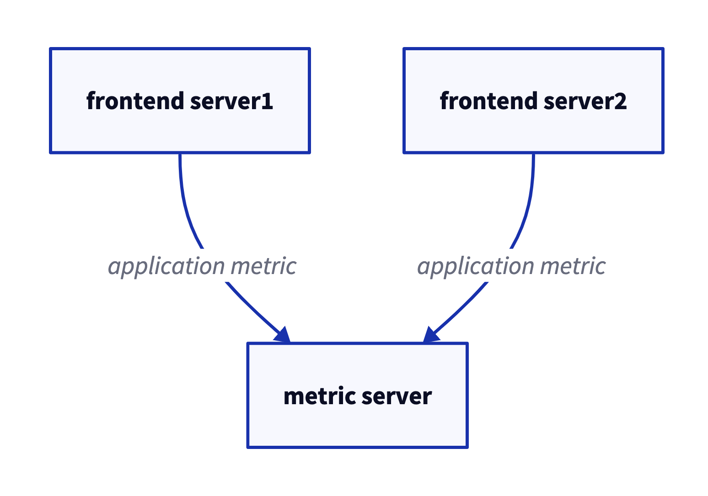
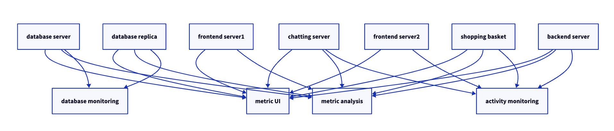
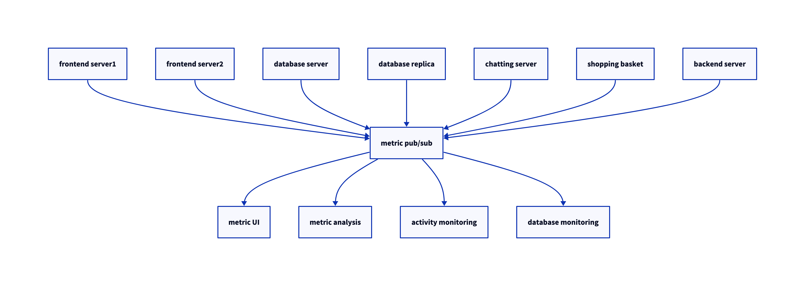

# 1. 카프카 시작하기

- 모든 기업은 데이터로 움직인다. 모든 애플리케이션은 데이터를 생성한다.
- 데이터는 중요한 정보를 담고있으며, 이를 파악하기 위해서는 데이터를 **생성된 곳**에서 **분석할 수 있는 곳**으로 옮겨야 한다.
- 이러한 작업을 더 빠르게 해낼수록 조직은 더 유연해지고 더 민첩해질 수 있음
  - 데이터를 이동 시키는데 더 적은 노력을 들일수록 **핵심 비즈니스에 더 집중**할 수 있다
  - Data-driven enterprise에서 pipeline이 중요한 핵심적인 이유

## 1.1 발생/구독 메시지 전달

- publish/subscribe messaging의 개념과 데이터 주도 애플리케이션에서의 중요성을 이해해야 함
- 이 패턴의 특징은 전송자가 데이터를 보낼 때 **직접 수신자로 보내지 않는다는 것**
  - 전송자는 어떤 형태로든 메시지를 분류해서 보내고, 수신자는 이런게 분류된 메시지를 **구독**한다
- 메시지를 전달받고 중계해주는 **브로커**가 있다

### 1.1.1 초기의 발행/구독 시스템

- 가운데 간단한 메시지 큐나 프로세스간 통신 채널을 놓는 것이 초기 형태
- 초기에는 잘 동작하지만, 장기간에 걸쳐 지푯값을 분석하고자 하면 잘 되지 않는다.
- 지표를 저장 및 분석하는 새로운 서비스를 하나 만들면, 그 때마다 새로운 연결이 여러개 추가된다 (그림 1-2)

- 이 방식은 technical debt가 엄청나 보이기 때문에 개선이 필요하다
- 모든 애플리케이션으로부터 지표를 받는 하나의 애플리케이션을 만들고, 이 지푯발들을 필요로 하는 어느 시스템이든 지표를 질의할 수 있도록 해주는 서버를 제공

### 1.1.2 개별 메시지 큐 시스템

- 지표를 다루는 것과 동시에 로그 메시지에 대해서도 비슷한 작업을 해줘야 한다.
- 그림 1-4 참고
- 그림 1-2보다는 낫지만, 버그도 한계도 제각각인 다수의 데이터 큐 시스템을 유지 관리해야 함
  - 메시지 교환을 필요로 하는 사례가 추가로 생길 수 있음
- 일반화된 유형의 데이터를 발행하고 구독할 수 있는 **중앙 집중화된 시스템**이 필요

## 1.2 카프카 입문

- 아파치 카프카는 위 문제를 해결하기 위해 고안된 message pub/sub system임
  - `분산 커밋 로그` 혹은 `분산 스트리밍 플랫폼`이라고 불리기도 함
- 카프카에 저장된 데이터는 **순서를 유지한 채**로 **지속성** 있게 보관되며 **결정적deterministic**으로 읽을 수 있다
- 확장시 성능 향상, 실패시에도 데이터 사용가능하도록 시스템 안에서 데이터를 분산 저장

### 1.2.1 메시지와 배치

- 카프카에서 데이터의 기본 단위는 **메시지**다.
- 메시지는 `key`라 불리는 메타데이터 포함 가능, `key`는 메시지를 저장할 파티션을 결정하기 위해 사용됨
  - 가장 간단한 방법은 키값에서 일정한 해시값을 생성 -> 토픽의 파티션 수로 modular -> 해당 파티션에 저장
- 카프카는 효율성을 위해 메시지를 `batch` 단위로 저장
  - 같은 토픽의 파티션에 쓰여지는 메시지들의 집합
  - 네트워크 오버헤드를 줄일 수 있음 (모아서 보내기 때문에)
  - latency를 늘리고, throughput을 늘릴 수 있다 (trade off)
  - 효율적인 데이터 처리를 위해 압축을 사용하는 경우가 많다

### 1.2.2 스키마

- 카프카 입장에서 메시지는 그냥 바이트 배열일 뿐이지만, 메시지 스키마가 있다
- JSON이나 XML 등이 쓰인다
- 하지만, 타입 처리 기능 등이 부실하여 `Avro`를 선호함 (Hadoop 프로젝트를 위한 직렬화 프레임워크)
  - 메시지 본체와 스키마를 분리하기 때문에, 스키마가 변경되어도 코드를 생성할 필요 X
  - 강력한 데이터 타이핑과 스키마 변경에 따른 상/하위 호환성 지원

### 1.2.3 토픽과 파티션

- 카프카에 저장되는 메시지는 `topic` 단위로 분류됨
  - 토픽과 비슷한 개념으로는 데이터베이스의 테이블이나 파일시스템의 폴더가 있음
- 토픽은 다시 여러 개의 `partition`으로 나뉘어 진다.
- 커밋 로그의 관점에서는 파티션은 하나의 로그에 해당
- 파티션에 메시지가 쓰여질 때는 append-only한 형태로 쓰여 짐
- 토픽에 여러 개의 파티션이 있는 만큼 토픽 안의 메시지 전체에 대해 순서는 보장되지 않으며, 단일 파티션 안에서만 순서가 보장 됨
- 그림 1-5 참고
- 각 파티션이 서로 다른 서버에 저장될 수 있기 때문에 하나의 토픽이 여러 개의 서버로 수평적으로 확장 가능
- 파티션은 복제 가능함, 서로 다른 서버들이 파티션의 복제본을 가질 수 있기 때문에 안정성 제공
- `stream` :  (파티션의 갯수와 상관없이) 하나의 토픽에 저장된 데이터로 간주되며, `producer`로부터 `consumer`로의 하나의 데이터 흐름을 나타 냄

### 1.2.4 프로듀서와 컨슈머

- 카프카의 클라이언트 : `producer`, `consumer`
- 고급 클라이언트 API : `Kafka Connect`, `Kafka Streams`
- `Producer`
  - 새로운 메시지를 생성
  - 다른 pub/sub 시스템에서는 `publisher` 혹은 `writer`라고도 부름
  - 토픽에 손한 파티션들 사이에 고르게 나눠서 메시지를 작성 함
  - 특정 경우에 특정 파티션을 지정해서 메시지를 쓰기도 함
    - 이 경우 key과 key값의 hash를 특정 파티션으로 대응시켜주는 `partitioner`를 사용해서 구현
- `Consumer`
  - 메시지를 읽음
  - 다른 pub/sub 시스템에서는 `subscriber` 혹은 `reader`라고도 함
  - 1개 이상의 토픽을 구독해서 여기에 저장된 메시지들을 각 파티션에 쓰여진 순서대로 읽어 옴
  - 메시지의 offset을 기록함으로써 어느 메시지까지 앍었는지를 유지
  - Offset은 지속적으로 증가하는 정수값, 카프카가 메시지를 저장할 때 각각의 메시지에 부여해주는 메타데이터
    - 주어진 파티션의 각 메시지는 고유한 오프셋을 가지며, 뒤에 오는 메시지가 앞의 메시지보다 더 큰 오프셋을 가짐
    - 저장되는 값이므로, 읽기 작업을 정지했다가 다시 시작하더라도 마지막으로 읽었던 메시지의 바로 다음 메시지부터 읽을 수 있음
  - 컨슈머는 컨슈머 그룹의 일원으로서 작동
- `Consumer Group`
  - 토픽에 저장된 데이터를 읽어오기 위해 협업하는 하나 이상의 컨슈머로 이루어 짐
  - 그림 1-6 참고
  - 컨슈머에서 파티션으로의 대응 관계는 컨슈퍼의 파티션 `ownership`이라고 부름
  - 이 방법을 사용함으로써 대량의 메시지를 갖는 토픽들을 읽기 위해 컨슈머들을 **수평 확장** 할 수 있음
  - 장애 대응 가능 (하나가 뻗으면 컨슈머 그룹에 해당 파티션을 읽어오는 새로운 컨슈머 할당)

### 1.2.5 브로커와 클러스터

- 하나의 카프카 서버를 `broker`라고 부른다
- 브로커는 프로듀서로부터 메시지를 전달받아 오프셋을 항당한 뒤 디스크 저장소에 쓴다
- 브로커는 컨슈머의 파티션 읽기 (fetch) 요청 역시 처리하고 발행된 메시지를 보내준다.
- 하나의 브로커는 초당 수천 개의 파티션과 수백만 개의 메시지를 쉽게 처리할 수 있음
- 카프카 브로커는 `cluster`의 일부로써 작동하도록 설계됨
- 하나의 클러스터 안에 여러 개의 브로커가 포함될 수 있으며, 그중 하나의 브로커가 클러스터 `controller`의 역할을 하게 됨 (자동으로 선출 됨)
- 컨트롤러는 파티션을 브로커에 할당해주거나 장애가 발생한 브로커를 모니터링하는 등의 관리 기능을 담당
- 파티션은 클러스터 안의 브로커 중 하나가 담당하며, 그 브로커를 `patrition leader`라고 부른다
- 그림 1-7 처럼 복제된 파티션이 여러 브로커에 할당될 수도 있는데 이것들은 파티션의 `follower`라고 부른다
- 복제 기능은 파티션의 메시지를 중복 저장함으로써 리더 브로커에 장애가 발생했을 때 팔로워 중 하나가 리더 역할을 이어받을 수 있도록 함
- 모든 프로듀서는 리더 브로커에 메시지를 발행해야 하지만, 컨슈머는 리더나 팔로워 중 하나로부터 데이터를 읽어올 수 있음
- 일정 기간 동안 메시지를 지속성 있게 보관하는 보존 기능이 있음
  - 특정 기간 혹은 파티션의 크기가 특정 사이즈에 도달할 때까지 데이터를 보존
  - 한도값에 도달하면 메시지는 만료되어 삭제
  - 각각의 토픽마다 다르게 설정 가능 (사용자 활동 추적 토픽 ~ 며칠, 애플리케이션 지표 ~ 몇시간)
  - 로그 압착 기능 : 같은 키를 갖는 메시지 중 가장 최신의 것만 보존 (changelog 형태의 데이터에 유용)

### 1.2.6 다중 클러스터

- 카프카가 활장되어감에 따라 다수의 클러스터를 운용하는 것이 나은 경우가 있음
  - 데이터의 유형별 분리
  - 보안 요구사항을 충족시키기 위한 격리
  - 재해 복구 (DR)를 대시한 다중 데이터센터

- 특히 카프카가 다수의 데이터센터에서 운용될 때는 데이터센터 간에 메시지를 복제해 줄 필요가 있는 경우가 많음
- 카프카 프로젝트는 데이터를 다른 클러스터로 복제하는 데 사용되는 `MirrorMaker`라는 툴을 포함 함
  - 근본적으로 미러메이커도 단지 큐로 연결된 카프카 컨슈머와 프로듀서에 불과
  - 하나의 카프카 클러스터에서 메시지를 읽어와서 다른 클러스터에 쓴다
  - 그림 1-8 참고 : 두 개의 로컬 클러스터의 메시지를 하나의 집적 클러스터로 모은 뒤 다른 데이터 센터로 복사

## 1.3 왜 카프카인가?

- pub/sub 메시지 전달 시스템은 많은데, 왜 하필 카프카?

### 1.3.1 다중 프로듀서

- 카프카는 자연스럽게 여러 프로듀서 처리 가능
- 많은 프론트엔드 시스템으로부터 데이터를 수집하고 일관성을 유지하는 데 적격

### 1.3.2 다중 컨슈머

- 많은 컨슈머가 상호 간섭 없이 어떠한 메시지 스트림도 읽을 수 있도록 설계 됨
- 하나의 메시지를 하나의 클라이언트에서만 소비할 수 있도록 되어 있는 **많은 큐 시스템과의 결정적인 차이점**
- 다수의 카프카 컨슈머는 컨슈머 그룹의 일원으로 작동함으로써 하나의 스트림을 **여럿이서 나눠서 읽을 수 있다**

### 1.3.3 디스크 기반 보존

- 메시지를 지속성 있게 저장 가능
- 메시지는 디스크에 쓰여진 뒤 설정된 보유 규칙과 함께 저장
- 필요에 따라 서로 다른 기간동안 보존될 수 있음
- 컨슈머를 정지하더라고 메시지는 카프카 안에 남아있음
- 다시 시작해도 유실 없음

### 1.3.4 확장성

- 어떠한 크기의 데이터도 쉽게 처리 가능
- 클러스터 확장이 용이함

### 1.3.5 고성능

- 위 특징들 덕분에 고부하 아래에서도 높은 성능을 보임

### 1.3.6 플랫폼 기능

- 카프카 커낵트는 소스 데이터 시스템으로부터 카프카로 데이터를 가져오거나 카프카의 데이터를 싱크 시스템으로 내보내는 작업을 도와 줌
- 카프카 스트림즈는 규모 가변성과 내고장성을 갖춘 스트림 처리 애플리케이션을 쉽게 개발할 수 있게 해주는 라이브러리

## 1.4 데이터 생태계

- 데이터 생태계에 있어서 순환 시스템을 제공 (그림 1-9)
- 모든 클라이언트에 대해 일관된 인터페이스를 제공하면서 다양한 인프라스트럭처 요소들 사이에 머시지를 전달하는 것
- 메시지 스키마를 제공하는 시스템과 결합하면 프로듀서와 컨슈머는 **더 이상 어떤 형태로든 밀접하게 결합되거나 연결될 필요가 없다**
  - 필요할 때마다 관련 컴포넌트를 추가하거나 제거해주면 되며, 프로듀서는 누가 데이터를 사용하는지, 컨슈머 애플리케이션이 몇 개인지와 같은 것에 신경 쓸 필요가 없다

### 1.4.1 이용 사례

#### 활동 추적

- LinkedIn에서 사용자 활동 추적에 사용
- 프론트엔드 애플리케이션의 작동 로그가 하나 이상의 토픽으로 발행되서 백엔드에서 작동 중인 애플맄이션에 전달

#### 메시지 교환

- 같은 룩앤필을 사용해서 메시지를 포매팅 혹은 데코레이팅
- 여러 개의 메시지를 모아서 하나의 알림 메시지로 전송
- 사용자가 원하는 메시지 수신 방식을 적용

#### 지표 및 로그 수집

- 카프카는 애플리케이션과 시스템의 지푯값과 로그를 수집하는 데도 이상적
- 여러 애플리세이션이 같은 유형으로 생성한 메시지를 활용하는 대표적인 사례
- 애플리케이션이 정기적으로 지푯값을 카프카 **토픽에 발행**하면, 모니터링과 경보를 맡고 있는 시스템이 이 지푯값들을 **가져다 사용**
- 로그 메시지 역시 같은 방식으로 발행 가능
- 목적 시스템을 변경해야 할 때 프론트 엔드 app이나 메시지 수집 방법을 변경할 필요 없음

#### 커밋 로그

- 데이터베이스에 가해진 변경점들이 (스트림의 형태로) 카르카로 발행될 수 있음
- 메시지 보존 기능 역시 체인지로그를 저장하는 버퍼로서 유용하게 사용될 수 있음

#### 스트림 처리

- 메시지가 생성되자마자 실시간으로 데이터를 처리
- 다수의 원본으로부터 들어온 데이터를 사용해서 메시지를 변환

## 1.5 카프카의 기원

- 링크드인 내부에서 데이터 파이프라인 문제를 해결하기 위해 개발
- 다양한 종유의 데이터를 다루고 고성능 메시지 교환 시스템 역할을 할 수 있도록 설계

### 1.5.1 링크드인이 직면한 문제

- 링크드인에서는 로그나 메트릭 말고도 복잡한 요청 추적 기능이 있었는데, 사용자 요청이 내부의 여러 애플리케이션에 어떻게 전파되는지를 보여주는 것
- 이는 매우 복잡하고, 기존의 폴링 방식은 구멍이 많고 유지보수가 힘들었음
- HHTP 서비스, XML 형식 메시지 배치를 사용했으나, 형식에 일관성이 없고 파싱하는데 컴퓨팅이 많이 들었음
- 추적되는 사용자 활동 유형을 변경하려면, 다른 애플리케이션에 많은 추가 작업이 필요
- ...
- ActiveMQ를 사용해보았으나 규모 확장성이 떨어짐, 결함이 많았음
- 직접 개발하자..!

### 1.5.2 카프카의 탄생

- 똑똑한 사람들이 모여서 프로젝트 시작
- 주된 목표
  - 푸시-풀 모델 (push-pull model)을 사용함으로써 프로듀서와 컨슈머를 분리 (decouple) 시킨다
  - 다수의 컨슈머가 사용할 수 있도록 메시지 교환 시스템의 데이터를 영속적으로 저장한다
  - 높은 메시지 처리량을 보일 수 있도록 최적화한다
  - 데이터 스트림의 양이 증가함에 따라 시스템을 수평 확장할 수 있도록 한다
- 카프카는 링크드인 안에서 2020년 2월 기준 매일 7조개의 메시지를 쓰고 5PB가 넘는 데이터를 읽을 수 있는 시스템으로 성장

### 1.5.3 오픈소스

- 2010년 말 github에 오픈소스로 공개
- 2011년 7월 Apache Software Foundation의 인큐베이터 프로젝트 -> 2012년 10월 정식 프로젝트

### 1.5.4 상업적 제품

- Confluent에서 제공
- 여러 클라우드에서 상용제품 제공

### 1.5.5. 이름

- 제이 크랩스가 프란트 카프카 작품 좋아해서 그렇게 지음

## 1.6 카프카 시작하기

- 다음 장부터 시작해보자!
